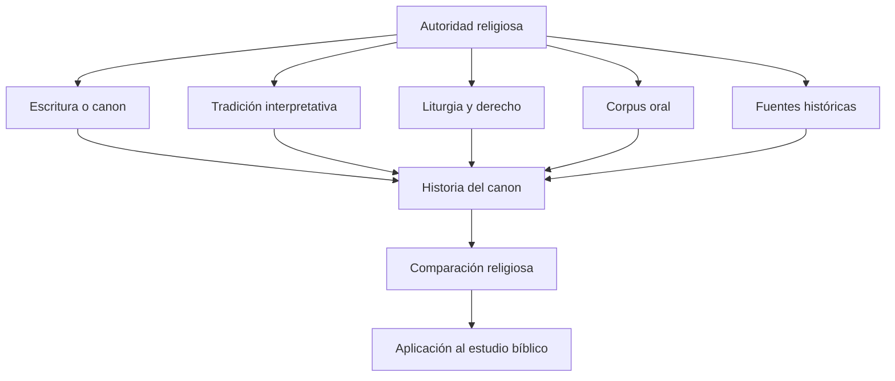

# 00 - MOC - Religiones del mundo y sus textos sagrados

> [!abstract] Propósito
> Este conjunto de notas estudia las principales tradiciones religiosas del mundo, sus textos de autoridad y la forma en que transmiten doctrina, liturgia, ley, memoria y revelación. La pregunta rectora no es solamente **«¿cuál es su libro sagrado?»**, sino:
>
> **¿Dónde considera cada tradición que reside la autoridad religiosa, cómo afirma que esa autoridad fue recibida y mediante qué mecanismos se ha transmitido hasta nuestros días?**

## Navegación principal

1. [[Proyecto Biblia/Arte, cultura y otros temas/Religiones_del_Mundo/01 - Metodología comparativa y niveles de autoridad|Proyecto Biblia/Arte, cultura y otros temas/Religiones_del_Mundo/01 - Metodología comparativa y niveles de autoridad]]
2. [[Proyecto Biblia/Arte, cultura y otros temas/Religiones_del_Mundo/02 - Religiones abrahámicas|Proyecto Biblia/Arte, cultura y otros temas/Religiones_del_Mundo/02 - Religiones abrahámicas]]
3. [[Proyecto Biblia/Arte, cultura y otros temas/Religiones_del_Mundo/03 - Hinduismo, jainismo y sijismo|Proyecto Biblia/Arte, cultura y otros temas/Religiones_del_Mundo/03 - Hinduismo, jainismo y sijismo]]
4. [[Proyecto Biblia/Arte, cultura y otros temas/Religiones_del_Mundo/04 - Budismo y sus cánones|Proyecto Biblia/Arte, cultura y otros temas/Religiones_del_Mundo/04 - Budismo y sus cánones]]
5. [[Proyecto Biblia/Arte, cultura y otros temas/Religiones_del_Mundo/05 - Asia oriental y Sudeste asiático|Proyecto Biblia/Arte, cultura y otros temas/Religiones_del_Mundo/05 - Asia oriental y Sudeste asiático]]
6. [[Proyecto Biblia/Arte, cultura y otros temas/Religiones_del_Mundo/06 - Asia central, Siberia y Ártico|Proyecto Biblia/Arte, cultura y otros temas/Religiones_del_Mundo/06 - Asia central, Siberia y Ártico]]
7. [[Proyecto Biblia/Arte, cultura y otros temas/Religiones_del_Mundo/07 - Zoroastrismo y religiones iranias|Proyecto Biblia/Arte, cultura y otros temas/Religiones_del_Mundo/07 - Zoroastrismo y religiones iranias]]
8. [[Proyecto Biblia/Arte, cultura y otros temas/Religiones_del_Mundo/08 - Mandeísmo, maniqueísmo y gnosticismos|Proyecto Biblia/Arte, cultura y otros temas/Religiones_del_Mundo/08 - Mandeísmo, maniqueísmo y gnosticismos]]
9. [[Proyecto Biblia/Arte, cultura y otros temas/Religiones_del_Mundo/09 - Religiones de África|Proyecto Biblia/Arte, cultura y otros temas/Religiones_del_Mundo/09 - Religiones de África]]
10. [[Proyecto Biblia/Arte, cultura y otros temas/Religiones_del_Mundo/10 - Religiones de América|Proyecto Biblia/Arte, cultura y otros temas/Religiones_del_Mundo/10 - Religiones de América]]
11. [[Proyecto Biblia/Arte, cultura y otros temas/Religiones_del_Mundo/11 - Oceanía y Australia|Proyecto Biblia/Arte, cultura y otros temas/Religiones_del_Mundo/11 - Oceanía y Australia]]
12. [[Proyecto Biblia/Arte, cultura y otros temas/Religiones_del_Mundo/12 - Religiones antiguas de Grecia, Roma, celtas y germanos|Proyecto Biblia/Arte, cultura y otros temas/Religiones_del_Mundo/12 - Religiones antiguas de Grecia, Roma, celtas y germanos]]
13. [[Proyecto Biblia/Arte, cultura y otros temas/Religiones_del_Mundo/13 - Arabia preislámica, Fenicia, Ugarit, Mesopotamia y Egipto|Proyecto Biblia/Arte, cultura y otros temas/Religiones_del_Mundo/13 - Arabia preislámica, Fenicia, Ugarit, Mesopotamia y Egipto]]
14. [[Proyecto Biblia/Arte, cultura y otros temas/Religiones_del_Mundo/14 - Nuevos movimientos religiosos|Proyecto Biblia/Arte, cultura y otros temas/Religiones_del_Mundo/14 - Nuevos movimientos religiosos]]
15. [[Proyecto Biblia/Arte, cultura y otros temas/Religiones_del_Mundo/15 - Apócrifos, pseudoepígrafos y literatura perdida|Proyecto Biblia/Arte, cultura y otros temas/Religiones_del_Mundo/15 - Apócrifos, pseudoepígrafos y literatura perdida]]
16. [[Proyecto Biblia/Arte, cultura y otros temas/Religiones_del_Mundo/16 - Cómo se forma un canon religioso|Proyecto Biblia/Arte, cultura y otros temas/Religiones_del_Mundo/16 - Cómo se forma un canon religioso]]
17. [[Proyecto Biblia/Arte, cultura y otros temas/Religiones_del_Mundo/17 - Tabla maestra de religiones|Proyecto Biblia/Arte, cultura y otros temas/Religiones_del_Mundo/17 - Tabla maestra de religiones]]
18. [[Proyecto Biblia/Arte, cultura y otros temas/Religiones_del_Mundo/18 - Aplicación directa al estudio bíblico|Proyecto Biblia/Arte, cultura y otros temas/Religiones_del_Mundo/18 - Aplicación directa al estudio bíblico]]
19. [[Proyecto Biblia/Arte, cultura y otros temas/Religiones_del_Mundo/19 - Bibliografía académica prioritaria|Proyecto Biblia/Arte, cultura y otros temas/Religiones_del_Mundo/19 - Bibliografía académica prioritaria]]
20. [[Proyecto Biblia/Arte, cultura y otros temas/Religiones_del_Mundo/20 - Plantilla para estudiar una religión|Proyecto Biblia/Arte, cultura y otros temas/Religiones_del_Mundo/20 - Plantilla para estudiar una religión]]
21. [[Proyecto Biblia/Arte, cultura y otros temas/Religiones_del_Mundo/98 - Correcciones históricas incorporadas|Proyecto Biblia/Arte, cultura y otros temas/Religiones_del_Mundo/98 - Correcciones históricas incorporadas]]

## Estructura conceptual

## Modelos generales detectados

- **Revelación + libro central:** islam, sijismo, bahá'í, algunas nuevas religiones.
- **Canon + tradición interpretativa:** judaísmo rabínico, cristianismo, islam.
- **Múltiples escrituras y escuelas:** hinduismo, budismo, jainismo, daoísmo.
- **Revelación continua o canon abierto:** determinadas nuevas religiones y movimientos proféticos.
- **Tradición oral estructurada:** Ifá, Yārsān histórico, religiones indígenas, Siberia, Australia.
- **Religiones rituales sin canon:** Grecia, Roma, Fenicia, antiguas religiones germánicas.

## Idea central

No todas las religiones se ajustan al modelo:

> **fundador + libro sagrado + iglesia**

Hay religiones sin fundador, sin canon, con varios cánones, con tradición oral, con escrituras abiertas o con autoridad concentrada en rituales y especialistas religiosos.

---

## Próximos estudios conectados

- [[Proyecto Biblia/Arte, cultura y otros temas/Religiones_del_Mundo/16 - Cómo se forma un canon religioso|Proyecto Biblia/Arte, cultura y otros temas/Religiones_del_Mundo/16 - Cómo se forma un canon religioso]]
- [[Proyecto Biblia/Arte, cultura y otros temas/Religiones_del_Mundo/15 - Apócrifos, pseudoepígrafos y literatura perdida|Proyecto Biblia/Arte, cultura y otros temas/Religiones_del_Mundo/15 - Apócrifos, pseudoepígrafos y literatura perdida]]
- [[Proyecto Biblia/Arte, cultura y otros temas/Religiones_del_Mundo/18 - Aplicación directa al estudio bíblico|Proyecto Biblia/Arte, cultura y otros temas/Religiones_del_Mundo/18 - Aplicación directa al estudio bíblico]]

## Creencias y doctrinas

- [[21 - En qué cree cada religión|21 - En qué cree cada religión]]

## Enciclopedia por religión

- [[21 - En qué cree cada religión|21 - En qué cree cada religión]] — consulta doctrinal rápida.
- [[30 - MOC - Fichas completas por religión|30 - MOC - Fichas completas por religión]] — fichas completas con la plantilla de 22 apartados.
- [[Proyecto Biblia/Arte, cultura y otros temas/Religiones_del_Mundo/20 - Plantilla para estudiar una religión|Proyecto Biblia/Arte, cultura y otros temas/Religiones_del_Mundo/20 - Plantilla para estudiar una religión]] — plantilla base actualizada.
