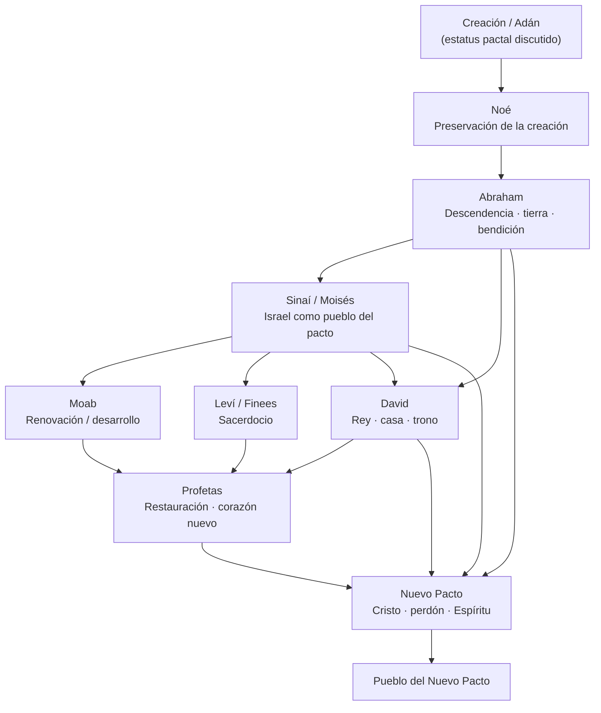

# Los_pactos_en_la_Biblia
## Naturaleza, desarrollo, cumplimiento en Cristo y evaluación de las llamadas “ofrendas de pacto”

> [!abstract] Propósito
> Este estudio busca responder cuatro preguntas:
>
> 1. **¿Qué es realmente un pacto en la Biblia?**
> 2. **¿Cuáles son los principales pactos y cómo se relacionan entre sí?**
> 3. **¿Cómo culmina esta estructura en Cristo y el Nuevo Pacto?**
> 4. **¿Es bíblicamente válido “pactar con Dios” mediante dinero, ofrendas u otros actos para obtener una bendición concreta?**
>
> La metodología procura distinguir cuidadosamente entre **texto bíblico, contexto histórico, desarrollo canónico y sistemas teológicos posteriores**, evitando imponer desde el inicio una lectura reformada, dispensacionalista, pentecostal o de cualquier otra tradición.

---

# Índice

1. [[#1. Qué significa “pacto” en la Biblia| > 1. Qué significa “pacto” en la Biblia]]
2. [[#2. Elementos que suelen aparecer en un pacto bíblico| > 2. Elementos que suelen aparecer en un pacto bíblico]]
3. [[#3. El pacto y el antiguo Cercano Oriente| > 3. El pacto y el antiguo Cercano Oriente]]
4. [[#4. Mapa general de los pactos bíblicos| > 4. Mapa general de los pactos bíblicos]]
5. [[#5. El posible pacto con Adán o pacto de creación| > 5. El posible pacto con Adán o pacto de creación]]
6. [[#6. El pacto con Noé| > 6. El pacto con Noé]]
7. [[#7. El pacto con Abraham| > 7. El pacto con Abraham]]
8. [[#8. El pacto mosaico o sinaítico| > 8. El pacto mosaico o sinaítico]]
9. [[#9. El pacto de Moab| > 9. El pacto de Moab]]
10. [[#10. El pacto sacerdotal: Leví y Finees| > 10. El pacto sacerdotal: Leví y Finees]]
11. [[#11. El pacto davídico| > 11. El pacto davídico]]
12. [[#12. El Nuevo Pacto| > 12. El Nuevo Pacto]]
13. [[#13. Cómo se relacionan los pactos entre sí| > 13. Cómo se relacionan los pactos entre sí]]
14. [[#14. Renovaciones de pacto y otros pactos bíblicos| > 14. Renovaciones de pacto y otros pactos bíblicos]]
15. [[#15. Cristo y el cumplimiento de los pactos| > 15. Cristo y el cumplimiento de los pactos]]
16. [[#16. Los principales sistemas cristianos de interpretación| > 16. Los principales sistemas cristianos de interpretación]]
17. [[#17. Pacto, voto, ofrenda y promesa: conceptos que no deben confundirse| > 17. Pacto, voto, ofrenda y promesa: conceptos que no deben confundirse]]
18. [[#18. La tendencia contemporánea de “pactar con Dios” mediante dinero| > 18. La tendencia contemporánea de “pactar con Dios” mediante dinero]]
19. [[#19. Exégesis de los textos usados para defender “ofrendas de pacto”| > 19. Exégesis de los textos usados para defender “ofrendas de pacto”]]
20. [[#20. Textos de control para evaluar la práctica| > 20. Textos de control para evaluar la práctica]]
21. [[#21. Criterios de discernimiento pastoral| > 21. Criterios de discernimiento pastoral]]
22. [[#22. Conclusiones generales| > 22. Conclusiones generales]]
23. [[#23. Bibliografía académica recomendada| > 23. Bibliografía académica recomendada]]
24. [[#24. Ruta de estudio sugerida| > 24. Ruta de estudio sugerida]]

---

# 1. Qué significa “pacto” en la Biblia

## 1.1. בְּרִית — *berît*

El sustantivo hebreo más importante es **בְּרִית (*berît*)**, normalmente traducido como **pacto**, **alianza** o **convenio**.

La etimología exacta del término sigue siendo discutida. Por eso es más seguro definirlo por su **uso bíblico** que intentar construir toda la doctrina a partir de una etimología incierta.

En las Escrituras, *berît* puede referirse a:

- relaciones establecidas por Dios con seres humanos;
- relaciones entre individuos;
- acuerdos políticos;
- compromisos comunitarios;
- relaciones familiares o matrimoniales;
- promesas solemnes acompañadas de obligaciones.

Por tanto:

> [!important]
> **“Pacto” no significa exclusivamente “contrato comercial”.**
>
> Puede incluir obligaciones, condiciones, promesas y sanciones, pero el concepto bíblico es más amplio: crea o regula una **relación solemne y vinculante**.

La investigación moderna sobre pacto ha cuestionado definiciones antiguas demasiado reducidas que identificaban *berît* casi exclusivamente con “obligación”. Scott Hahn, al resumir la investigación académica de 1994–2004, observa una tendencia a comprender los pactos como relaciones que crean **vínculos, responsabilidades y obligaciones entre las partes**, sin reducirlos a un solo elemento jurídico.

---

## 1.2. “Cortar un pacto”

Una expresión hebrea frecuente es:

**כָּרַת בְּרִית — *kārat berît***

Literalmente:

**“cortar un pacto”.**

Ejemplos importantes:

- Génesis 15:18;
- Éxodo 24;
- Deuteronomio 5:2-3;
- Jeremías 34:18.

La expresión probablemente conserva memoria del carácter solemne de algunos ritos pactales, especialmente aquellos en los que se dividían animales.

Génesis 15 ofrece el ejemplo más impresionante:

- Abraham prepara animales partidos;
- una manifestación divina pasa entre las partes;
- Dios ratifica solemnemente su promesa.

Jeremías 34:18 confirma que pasar entre las partes de un animal podía expresar simbólicamente:

> **“Que me suceda lo que sucedió a este animal si quebranto el compromiso.”**

No todos los pactos bíblicos incluyen el mismo rito, pero esta imagen ayuda a comprender su solemnidad.

---

## 1.3. διαθήκη — *diathḗkē*

El término principal del Nuevo Testamento es:

**διαθήκη (*diathḗkē*)**.

La Septuaginta lo utiliza regularmente para traducir *berît*, de modo que en el Nuevo Testamento normalmente conserva el sentido bíblico de **pacto**.

Aparece especialmente en:

- las palabras de Jesús sobre la Cena;
- Pablo;
- Gálatas 3;
- 2 Corintios 3;
- Hebreos 7–13.

Hebreos 9:16-17 presenta una dificultad especial porque *diathḗkē* también podía utilizarse en griego para una disposición testamentaria. Existe un importante debate académico sobre si allí debe entenderse como “pacto”, “testamento” o mediante un juego semántico que aprovecha ambos sentidos.

Para nuestro estudio basta una conclusión:

> El Nuevo Testamento interpreta la obra de Cristo dentro de la historia de los **pactos bíblicos**, especialmente a partir de Jeremías 31.

---

# 2. Elementos que suelen aparecer en un pacto bíblico

No todos los pactos tienen exactamente la misma estructura. Sin embargo, pueden aparecer varios de los siguientes elementos:

| Elemento | Explicación |
|---|---|
| **Partes** | Dios y una persona, Dios y un pueblo, o seres humanos entre sí. |
| **Relación** | El pacto establece o regula una relación. |
| **Promesa** | Una o ambas partes asumen compromisos. |
| **Obligaciones** | Puede haber mandamientos o responsabilidades. |
| **Juramento** | Refuerza la solemnidad del compromiso. |
| **Señal** | Marca o recuerda el pacto. |
| **Sacrificio/sangre** | Aparece en algunos pactos como ratificación. |
| **Bendiciones** | Consecuencias de fidelidad. |
| **Maldiciones/sanciones** | Consecuencias de quebrantar determinados pactos. |
| **Memorial** | Algunos actos o señales recuerdan permanentemente el pacto. |

> [!note]
> Un error común consiste en exigir que **todos** los pactos tengan **todos** estos elementos. La Biblia presenta una familia de formas pactales relacionadas, no una plantilla rígida aplicada mecánicamente.

---

# 3. El pacto y el antiguo Cercano Oriente

El estudio de documentos hititas, asirios y otros textos del antiguo Cercano Oriente transformó la investigación moderna sobre los pactos bíblicos.

Autores como:

- George E. Mendenhall;
- Dennis J. McCarthy;
- Moshe Weinfeld;

compararon determinados textos bíblicos con tratados políticos antiguos.

## 3.1. Tratados soberano–vasallo

En términos generales, un gran rey podía establecer un tratado con un rey menor o pueblo dependiente.

Frecuentemente podían aparecer:

1. identificación del soberano;
2. prólogo histórico;
3. estipulaciones;
4. depósito o lectura pública;
5. testigos;
6. bendiciones;
7. maldiciones.

Se han observado semejanzas especialmente con:

- Éxodo;
- Deuteronomio;
- Josué.

Esto ayuda a comprender por qué el pacto sinaítico posee:

- un libertador/soberano;
- una historia previa de salvación;
- mandamientos;
- bendiciones;
- maldiciones;
- ceremonias de ratificación.

### Éxodo 20 como ejemplo

Antes de los mandamientos:

> “Yo soy YHWH tu Dios, que te saqué de la tierra de Egipto...”

Primero aparece la identidad y acción del Dios que salva.

Después vienen las estipulaciones.

Esto resulta teológicamente importante:

**liberación → pacto → obediencia**

y no:

**obediencia → compra de liberación.**

---

## 3.2. Concesiones reales

Moshe Weinfeld llamó la atención sobre otra clase de relación antigua: las **concesiones** otorgadas por un soberano como recompensa o favor.

Esta comparación ha sido utilizada para iluminar especialmente:

- el pacto con Abraham;
- el pacto con David.

En estos casos el énfasis recae más fuertemente en la **promesa otorgada por el soberano** que en una lista de obligaciones equivalente a un tratado vasallático.

---

## 3.3. Precaución metodológica

> [!warning]
> La Biblia no debe reducirse a una copia de tratados hititas o asirios.
>
> Las comparaciones ayudan a comprender el lenguaje y las formas culturales, pero **semejanza no equivale a identidad**.

La investigación posterior ha matizado algunas de las primeras reconstrucciones de Mendenhall y otros autores. Por ello, utilizaremos los paralelos del antiguo Cercano Oriente como **contexto**, no como molde que determine automáticamente el significado del texto bíblico.

---

# 4. Mapa general de los pactos bíblicos

La Biblia no ofrece una lista inspirada diciendo:

> “Existen exactamente siete pactos.”

El número depende de qué consideremos:

- pacto principal;
- renovación;
- aplicación de un pacto anterior;
- pacto humano;
- construcción teológica.

## 4.1. Cinco grandes pactos ampliamente reconocidos

Existe amplio acuerdo en reconocer como fundamentales:

1. **Noé**
2. **Abraham**
3. **Sinaí/Moisés**
4. **David**
5. **Nuevo Pacto**

## 4.2. Una clasificación ampliada

Para un estudio exhaustivo conviene examinar también:

1. Creación/Adán — **discutido**
2. Noé
3. Abraham
4. Sinaí/Moisés
5. Moab — **discutido como pacto distinto o renovación**
6. Sacerdotal/Leví/Finees
7. David
8. Nuevo Pacto

---

## 4.3. Diagrama de relaciones

> [!summary] Idea central
> Los pactos no deben imaginarse simplemente como contratos independientes colocados uno después de otro.
>
> Existe una **historia progresiva**:
>
> **creación → preservación → promesa → pueblo → reino → esperanza profética → Cristo → Nuevo Pacto.**

---

# 5. El posible pacto con Adán o pacto de creación

## Textos

- Génesis 1:26-30
- Génesis 2:15-17
- Génesis 3:15-19
- Oseas 6:7

## 5.1. El problema

Génesis 1–3 **no utiliza explícitamente *berît*** para describir la relación con Adán.

Sin embargo, existe una estructura relacional que algunos teólogos consideran pactual:

- Dios crea al ser humano;
- le confiere una vocación;
- establece mandamientos;
- promete vida dentro del orden creado;
- advierte una sanción por desobediencia.

Oseas 6:7 puede traducirse:

> “Como Adán transgredieron el pacto”.

Pero también existen debates sobre la traducción y el posible valor geográfico de “Adán”.

---

## 5.2. ¿Debemos llamarlo pacto?

### A favor

- existen partes;
- existe mandato;
- existe sanción;
- existe representación de la humanidad;
- Oseas 6:7 puede respaldar la idea.

### Precauciones

- Génesis nunca lo denomina explícitamente *berît*;
- “pacto de obras” es una categoría de la teología reformada;
- no debe presentarse como si Génesis utilizara literalmente ese nombre.

> [!important]
> La formulación más rigurosa es:
>
> **“relación de creación con características pactales”** o **“pacto de creación, según determinadas tradiciones teológicas”**.

---

## 5.3. Relación con los demás pactos

La creación proporciona el escenario para todo lo posterior.

Los grandes temas aparecen desde Génesis:

- imagen de Dios;
- reino;
- tierra;
- humanidad;
- obediencia;
- vida;
- muerte;
- bendición;
- descendencia;
- victoria futura sobre el mal.

Génesis 3:15 introduce la esperanza de una descendencia que finalmente vencerá a la serpiente.

Así comienza una línea que desembocará en la historia redentora.

---

# 6. El pacto con Noé

## Textos

- Génesis 6:18
- Génesis 8:20-22
- Génesis 9:1-17

Aquí la palabra **pacto** aparece explícitamente.

## 6.1. Partes

Dios establece su pacto con:

- Noé;
- sus descendientes;
- todos los seres vivos.

## 6.2. Promesa principal

Dios promete no volver a destruir toda carne mediante un diluvio como aquel.

## 6.3. Señal

**El arco iris.**

## 6.4. Alcance

Universal.

No se limita a Israel.

Incluye a la humanidad y a los seres vivientes.

## 6.5. Función en la historia bíblica

Después del juicio del diluvio, Dios garantiza la **estabilidad del escenario creado** donde continuará su propósito redentor.

Por eso su relación con Abraham es importante:

**Noé preserva el mundo → Abraham introduce la línea de bendición para las naciones.**

El pacto noético no es todavía la solución final al pecado.

Garantiza que la historia humana continuará mientras Dios lleva adelante su propósito.

---

# 7. El pacto con Abraham

## Textos fundamentales

- Génesis 12:1-3
- Génesis 15
- Génesis 17
- Génesis 22:15-18

El pacto con Abraham es uno de los ejes más importantes de toda la Biblia.

## 7.1. Cuatro grandes dimensiones

### Descendencia

Abraham será padre de una gran multitud.

### Tierra

Se promete la tierra de Canaán.

### Relación con Dios

Dios será Dios de Abraham y de su descendencia.

### Bendición universal

Por medio de Abraham:

> serán benditas las familias o naciones de la tierra.

Este último punto conecta directamente el pacto abrahámico con la misión universal del Nuevo Testamento.

---

## 7.2. Génesis 15

Abraham pregunta cómo se cumplirán las promesas.

Dios realiza una ceremonia de pacto.

La presencia divina pasa entre los animales partidos.

El énfasis recae poderosamente en la fidelidad de Dios a su promesa.

---

## 7.3. Génesis 17

El pacto se desarrolla con mayor precisión.

Aparecen:

- Abraham como padre de muchas naciones;
- reyes procedentes de él;
- relación permanente con Dios;
- la tierra;
- la circuncisión.

### Señal

**La circuncisión.**

---

## 7.4. ¿Génesis 15 y 17 son pactos distintos?

Es un punto discutido.

Una lectura frecuente los comprende como **momentos diferentes del mismo complejo pactual abrahámico**:

- promesa inicial;
- ratificación;
- desarrollo;
- señal.

Otros autores distinguen más fuertemente sus aspectos.

Paul R. Williamson ha dedicado especial atención al desarrollo de las promesas patriarcales y su relación con los pactos.

Para este estudio utilizaremos la formulación:

> **Pacto abrahámico con distintas etapas de revelación y ratificación.**

---

## 7.5. Relación con Cristo

El Nuevo Testamento conecta directamente a Jesús con Abraham.

### Mateo 1:1

Jesús aparece como:

- hijo de David;
- hijo de Abraham.

### Gálatas 3

Pablo interpreta la promesa abrahámica a la luz de Cristo y de la incorporación de las naciones a la bendición prometida.

La relación es:

**Abraham → descendencia → bendición de las naciones → Cristo → pueblos de todas las naciones.**

---

# 8. El pacto mosaico o sinaítico

## Textos

- Éxodo 19–24
- Éxodo 31
- Éxodo 34
- Levítico
- Deuteronomio

Dios libera primero a Israel de Egipto.

Después establece el pacto.

> [!important]
> El orden es teológicamente significativo:
>
> **redención → relación pactual → obediencia**
>
> Israel no guarda la Ley para conseguir el éxodo; recibe la Ley después de haber sido liberado.

---

## 8.1. Identidad de Israel

Éxodo 19:5-6 presenta a Israel como:

- especial tesoro;
- reino de sacerdotes;
- nación santa.

El pacto organiza su vida como pueblo de Dios.

---

## 8.2. Contenido

Incluye:

- Decálogo;
- leyes sociales;
- leyes cultuales;
- sacerdocio;
- tabernáculo;
- sacrificios;
- fiestas;
- pureza ritual;
- justicia comunitaria.

No debemos fragmentar demasiado rápido la Ley en categorías posteriores sin observar primero cómo funciona como conjunto dentro del pacto.

---

## 8.3. Ratificación con sangre

Éxodo 24:8:

> “He aquí la sangre del pacto...”

Este lenguaje reaparecerá de manera decisiva en las palabras de Jesús durante la última cena.

---

## 8.4. Señal

Éxodo 31:13-17 presenta el **sábado** como señal entre YHWH e Israel.

---

## 8.5. Bendiciones y maldiciones

Especialmente:

- Levítico 26;
- Deuteronomio 28.

La obediencia pactual está asociada con bendiciones nacionales.

La rebelión conduce a:

- juicio;
- derrota;
- pérdida de la tierra;
- exilio.

Esto será fundamental para comprender a los profetas.

---

## 8.6. Función dentro de la historia

El pacto mosaico:

- no elimina las promesas hechas a Abraham;
- organiza a los descendientes de Abraham como nación;
- define santidad, justicia y culto;
- expone el pecado;
- prepara categorías fundamentales para comprender a Cristo.

Entre ellas:

- sacrificio;
- sacerdocio;
- sangre;
- expiación;
- santidad;
- tabernáculo;
- mediador.

---

# 9. El pacto de Moab

## Texto principal

- Deuteronomio 29–30

Deuteronomio 29:1 describe un pacto en Moab además del realizado en Horeb/Sinaí.

Esto ha generado debate.

## 9.1. Dos interpretaciones principales

### Pacto distinto

Algunos consideran que el texto establece un pacto adicional con la nueva generación.

### Renovación/desarrollo del mosaico

Otros lo entienden como renovación y actualización del pacto sinaítico antes de entrar en la tierra.

Esta segunda opción explica bien:

- la continuidad con Deuteronomio;
- la nueva generación;
- la entrada en Canaán;
- la reafirmación de bendiciones y maldiciones.

---

## 9.2. Importancia teológica

Deuteronomio 30 anticipa temas que después serán esenciales:

- exilio;
- regreso;
- restauración;
- transformación interior;
- amor a Dios desde el corazón.

Deuteronomio 30:6 habla de la **circuncisión del corazón**.

Por eso Moab funciona como puente:

**Sinaí → fracaso/exilio → esperanza de transformación futura.**

---

# 10. El pacto sacerdotal: Leví y Finees

Este componente suele omitirse en esquemas demasiado simples.

## 10.1. Pacto con Leví

Malaquías 2:4-5 habla explícitamente del:

> “pacto con Leví”.

El contexto lo relaciona con:

- sacerdocio;
- enseñanza;
- reverencia;
- servicio.

Números 18:19 utiliza además la expresión:

> “pacto de sal”.

La imagen de la sal comunica permanencia y estabilidad.

---

## 10.2. Finees

Números 25:10-13.

Dios declara:

- “mi pacto de paz”;
- “pacto de sacerdocio perpetuo”.

Algunos lo consideran un pacto específico.

Otros lo interpretan como confirmación o desarrollo del orden sacerdotal.

---

## 10.3. Relación con Cristo

Este tema adquiere relevancia especial en Hebreos.

El Nuevo Testamento no presenta simplemente a Jesús continuando el sacerdocio levítico.

Hebreos desarrolla su sacerdocio a partir de:

**Melquisedec**, no de Leví.

Así puede argumentar simultáneamente:

- continuidad con las categorías sacerdotales;
- superioridad y transformación del orden anterior.

---

# 11. El pacto davídico

## Textos

- 2 Samuel 7:8-16
- 2 Samuel 23:5
- 1 Crónicas 17
- Salmo 89
- Salmo 132

Dios promete a David:

- una casa;
- descendencia;
- reino;
- trono;
- permanencia.

---

## 11.1. El juego con la palabra “casa”

David quiere construir una **casa/templo** para Dios.

Dios responde que Él construirá una **casa/dinastía** para David.

La promesa inmediata se relaciona con Salomón.

Pero el lenguaje de permanencia abre una expectativa que supera a cualquier rey individual.

---

## 11.2. El problema histórico

La monarquía davídica visible colapsa con el exilio.

Entonces surge la gran pregunta:

> **¿Ha fallado la promesa?**

Los profetas responden desarrollando la esperanza de un futuro descendiente davídico.

Ejemplos:

- Isaías 9;
- Isaías 11;
- Jeremías 23:5-6;
- Ezequiel 34:23-24;
- Ezequiel 37:24-25.

---

## 11.3. Relación con Cristo

El Nuevo Testamento presenta reiteradamente a Jesús como:

**Hijo de David.**

Mateo 1:1 une programáticamente:

**Abraham + David + Jesucristo.**

Así:

- Abraham aporta la promesa universal;
- David aporta la promesa real;
- Cristo aparece como descendiente y rey.

---

# 12. El Nuevo Pacto

## Profecía central

Jeremías 31:31-34.

Dios promete hacer:

> “un nuevo pacto con la casa de Israel y con la casa de Judá”.

## 12.1. Características

### Ley interior

La instrucción divina ya no queda presentada solamente externamente:

> será escrita en el corazón.

### Relación

> “Yo seré su Dios y ellos serán mi pueblo.”

### Conocimiento de Dios

Existe un conocimiento pactual profundo.

### Perdón

> Dios perdona la maldad.

---

## 12.2. Ezequiel y la misma esperanza

Aunque Ezequiel no utiliza siempre la misma expresión de Jeremías, desarrolla temas estrechamente relacionados:

- agua limpia;
- corazón nuevo;
- espíritu nuevo;
- Espíritu de Dios;
- restauración;
- pacto de paz.

Textos:

- Ezequiel 36:25-27;
- Ezequiel 37:26.

---

## 12.3. Jesús y la Cena

Lucas 22:20:

> “Esta copa es el nuevo pacto en mi sangre.”

1 Corintios 11:25 conserva la misma conexión.

Jesús interpreta su muerte como el acontecimiento mediante el cual se inaugura el Nuevo Pacto.

La relación con Éxodo 24 es significativa:

**Éxodo 24:** sangre del pacto.

**Última Cena:** nuevo pacto en la sangre de Cristo.

---

## 12.4. Hebreos

Hebreos constituye el tratamiento más extenso del Nuevo Pacto en el Nuevo Testamento.

Temas centrales:

- Cristo como mediador;
- sacrificio definitivo;
- sacerdocio superior;
- acceso a Dios;
- purificación de la conciencia;
- Jeremías 31;
- obsolescencia del antiguo orden pactual en relación con el nuevo.

Textos clave:

- Hebreos 7:22;
- Hebreos 8;
- Hebreos 9;
- Hebreos 10;
- Hebreos 12:24;
- Hebreos 13:20.

---

## 12.5. Una cuestión interpretativa importante

Jeremías dice literalmente:

> “casa de Israel y casa de Judá”.

El Nuevo Testamento aplica el lenguaje del Nuevo Pacto a la comunidad cristiana.

Las tradiciones cristianas discrepan sobre cómo debe entenderse la relación entre:

- Iglesia;
- Israel;
- promesas nacionales;
- cumplimiento presente;
- cumplimiento escatológico.

Este desacuerdo será tratado en [[#16. Los principales sistemas cristianos de interpretación| > 16. Los principales sistemas cristianos de interpretación]].

No es necesario resolverlo artificialmente para reconocer el punto central:

> **Jesús se presenta como mediador e inaugurador del Nuevo Pacto.**

---

# 13. Cómo se relacionan los pactos entre sí

## 13.1. Tabla de síntesis

| Pacto | Alcance | Tema principal | Señal/ratificación destacada | Desarrollo posterior |
|---|---|---|---|---|
| Creación/Adán | Humanidad | Vocación, obediencia, vida | No se identifica señal pactal explícita | Problema del pecado y necesidad de redención |
| Noé | Humanidad/creación | Preservación | Arco iris | Mantiene el escenario de la historia redentora |
| Abraham | Abraham, descendencia, naciones | Descendencia, tierra, bendición | Circuncisión; Génesis 15 | Israel, David, bendición de las naciones |
| Sinaí | Israel | Pueblo santo, Ley, culto | Sangre; sábado | Profetas, exilio, necesidad de renovación |
| Moab | Israel | Renovación, tierra, corazón | Renovación juramentada | Anticipa restauración y transformación |
| Sacerdotal | Leví/Finees | Mediación y sacerdocio | Servicio sacerdotal | Prepara categorías desarrolladas en Hebreos |
| David | Casa de David | Rey, reino, trono | Promesa jurada | Esperanza mesiánica |
| Nuevo Pacto | Inaugurado por Cristo | Perdón, corazón, Espíritu, acceso a Dios | Sangre de Cristo / Cena | Comunidad del Nuevo Pacto y consumación futura |

---

## 13.2. Una única historia, no pactos aislados

### Noé

Preserva el escenario.

### Abraham

Introduce las promesas que alcanzarán a las naciones.

### Sinaí

Forma a Israel como pueblo histórico de esas promesas.

### David

Concentra la esperanza en una dinastía y un rey.

### Profetas

Anuncian restauración después del fracaso pactual.

### Cristo

Reúne las líneas anteriores:

- descendiente de Abraham;
- hijo de David;
- mediador;
- sacrificio;
- sacerdote;
- rey.

### Nuevo Pacto

Realiza la esperanza profética de:

- perdón;
- renovación interior;
- Espíritu;
- relación restaurada con Dios.

---

## 13.3. Promesa y cumplimiento

Una manera útil de visualizarlo:

**creación**  
↓  
el ser humano fracasa

**Noé**  
↓  
Dios preserva la creación

**Abraham**  
↓  
Dios promete bendición universal

**Israel/Sinaí**  
↓  
Dios constituye un pueblo

**David**  
↓  
Dios promete un rey

**profetas**  
↓  
anuncian nueva obra divina

**Cristo**  
↓  
cumplimiento mesiánico

**Nuevo Pacto**  
↓  
perdón + Espíritu + pueblo renovado

---

# 14. Renovaciones de pacto y otros pactos bíblicos

No toda aparición de la palabra “pacto” introduce una nueva etapa de la historia redentora.

## 14.1. Josué 24

Josué convoca al pueblo en Siquem.

Israel reafirma su compromiso con YHWH.

Se trata principalmente de una **renovación pactual**.

---

## 14.2. Joiada

2 Reyes 11:17.

Se establece un compromiso:

- entre YHWH;
- el rey;
- el pueblo.

Tiene como objetivo restaurar el orden después de Atalía.

---

## 14.3. Josías

2 Reyes 23:1-3.

Después del hallazgo del libro de la Ley, Josías renueva el compromiso nacional.

No está inventando un nuevo pacto redentor.

Está respondiendo al pacto existente.

---

## 14.4. Esdras

Esdras 10:3 registra un compromiso solemne en un momento de crisis comunitaria.

---

## 14.5. Nehemías

Nehemías 9–10 presenta:

- confesión;
- memoria histórica;
- compromiso escrito;
- sellado.

Nuevamente encontramos **renovación y compromiso**, no un nuevo pacto equivalente a Abraham, Sinaí o David.

---

## 14.6. Pactos entre seres humanos

La palabra también puede describir relaciones humanas.

Ejemplos:

### Abraham y Abimelec
Génesis 21:22-32.

### Isaac y Abimelec
Génesis 26:26-31.

### Jacob y Labán
Génesis 31:43-54.

### David y Jonatán
1 Samuel 18:3; 20.

### Israel y los gabaonitas
Josué 9.

### Matrimonio
Malaquías 2:14 describe a la esposa como:

> “mujer de tu pacto”.

> [!important]
> Esto demuestra que **pacto** es una categoría relacional amplia.
>
> No toda aparición del término es un “pacto de salvación” ni una nueva etapa de la historia bíblica.

---

# 15. Cristo y el cumplimiento de los pactos

El Nuevo Testamento no presenta a Jesús como una figura desconectada del Antiguo Testamento.

Lo presenta en el punto donde convergen las promesas.

## 15.1. Abraham

Jesús es descendiente de Abraham.

En Él la bendición alcanza a las naciones.

→ [[#7. El pacto con Abraham| > 7. El pacto con Abraham]]

---

## 15.2. Moisés y Éxodo

Jesús utiliza lenguaje de:

- sangre del pacto;
- liberación;
- sacrificio;
- Pascua.

El Nuevo Testamento desarrolla categorías mosaicas para explicar su muerte.

→ [[#8. El pacto mosaico o sinaítico| > 8. El pacto mosaico o sinaítico]]

---

## 15.3. David

Jesús es el Hijo de David.

Su reino da cumplimiento a la esperanza de un rey definitivo.

→ [[#11. El pacto davídico| > 11. El pacto davídico]]

---

## 15.4. Sacerdocio

Hebreos presenta a Cristo como sumo sacerdote.

Pero no simplemente como sacerdote levítico:

> según el orden de Melquisedec.

→ [[#10. El pacto sacerdotal: Leví y Finees| > 10. El pacto sacerdotal: Leví y Finees]]

---

## 15.5. Nuevo Pacto

Jesús mismo interpreta su muerte:

> “el nuevo pacto en mi sangre”.

→ [[#12. El Nuevo Pacto| > 12. El Nuevo Pacto]]

---

## 15.6. Síntesis cristológica

> [!summary]
> En Cristo convergen:
>
> **Adán:** nueva humanidad  
> **Noé:** creación preservada y esperanza de renovación  
> **Abraham:** descendencia y bendición universal  
> **Moisés:** mediación, sacrificio y sangre  
> **David:** rey prometido  
> **Sacerdocio:** acceso a Dios  
> **Profetas:** corazón nuevo, Espíritu y restauración  
> **Nuevo Pacto:** perdón definitivo y nueva relación con Dios

Esta convergencia explica por qué una teología bíblica del pacto termina inevitablemente siendo una **cristología**.

---

# 16. Los principales sistemas cristianos de interpretación

Las diferencias entre sistemas teológicos no suelen comenzar preguntando:

> “¿Existieron Noé, Abraham, Sinaí y David?”

La mayoría reconoce esos datos.

El debate aparece al preguntar:

> **¿Cómo se relacionan los pactos y cómo se cumplen sus promesas?**

---

## 16.1. Teología del Pacto clásica

Especialmente asociada con la tradición reformada.

Suele organizar la historia mediante categorías teológicas como:

- pacto de obras;
- pacto de gracia;
- pacto de redención.

### Fortalezas

- fuerte unidad de la historia redentora;
- lectura cristológica;
- atención a continuidad entre Antiguo y Nuevo Testamento.

### Cuestiones debatidas

- si “pacto de obras” está suficientemente explícito en Génesis;
- cómo relaciona Israel e Iglesia;
- relación entre los pactos bíblicos explícitos y los pactos teológicos sistemáticos.

Autores representativos:

- O. Palmer Robertson;
- Meredith Kline;
- Michael Horton;
- Guy Waters y colaboradores.

---

## 16.2. Dispensacionalismo

Históricamente ha enfatizado más fuertemente:

- distinciones entre Israel e Iglesia;
- cumplimiento futuro de determinadas promesas nacionales;
- lectura más diferenciada de las administraciones históricas.

### Fortalezas

- atención al desarrollo histórico;
- preocupación por no absorber automáticamente a Israel dentro de la Iglesia;
- énfasis en promesas concretas del Antiguo Testamento.

### Cuestiones debatidas

- grado de continuidad entre los pactos;
- relación del Nuevo Pacto con la Iglesia;
- relación entre promesas nacionales y cumplimiento cristológico.

---

## 16.3. Dispensacionalismo progresivo

Intenta reconocer más continuidad y cumplimiento presente en Cristo que las formas clásicas del dispensacionalismo, manteniendo al mismo tiempo una futura dimensión para Israel.

Autores frecuentemente asociados:

- Craig Blaising;
- Darrell Bock.

---

## 16.4. New Covenant Theology

Enfatiza fuertemente:

- la centralidad del Nuevo Pacto;
- Cristo como cumplimiento de la Ley;
- discontinuidades importantes con el pacto mosaico.

Existe diversidad interna dentro de esta corriente.

---

## 16.5. Progressive Covenantalism

Asociado especialmente con:

- Peter J. Gentry;
- Stephen J. Wellum.

Su propuesta intenta ofrecer una vía alternativa tanto al:

- dispensacionalismo;
- como a la Teología del Pacto clásica.

Parte de la progresión histórica de los pactos bíblicos y busca derivar las conclusiones sistemáticas a partir de esa progresión.

Su obra principal:

**Kingdom through Covenant.**

---

## 16.6. Regla metodológica para este estudio

No utilizaremos uno de estos sistemas como filtro previo.

Procederemos así:

**texto bíblico**  
↓  
**contexto histórico**  
↓  
**desarrollo entre pactos**  
↓  
**cumplimiento neotestamentario**  
↓  
**comparación de sistemas**

Esto permite distinguir:

> **lo que el texto dice**

de

> **cómo una tradición organiza teológicamente lo que el texto dice.**

---

# 17. Pacto, voto, ofrenda y promesa: conceptos que no deben confundirse

Esta sección es esencial para evaluar la práctica contemporánea de “pactar con Dios”.

## 17.1. Pacto — *berît / diathḗkē*

Relación solemne y vinculante que establece:

- compromisos;
- identidad;
- promesas;
- obligaciones;
- en algunos casos señales, sanciones o juramentos.

---

## 17.2. Voto — *neder*

Un **voto** es una promesa que una persona hace delante de Dios.

Ejemplos:

- Jacob — Génesis 28:20-22;
- Israel — Números 21:2;
- Ana — 1 Samuel 1:11.

La Ley regula cuidadosamente los votos:

- Números 30;
- Deuteronomio 23:21-23.

Eclesiastés 5:4-5 advierte contra prometer irresponsablemente.

### Dato decisivo

Deuteronomio 23:22 enseña que:

> **no hacer voto no constituye pecado.**

Por tanto, nadie puede afirmar bíblicamente que una persona necesita obligatoriamente “hacer un pacto” para que Dios escuche su petición.

---

## 17.3. Ofrenda

Es aquello que se entrega:

- a Dios;
- al culto;
- para ayudar a otros;
- para sostener la obra.

En el Nuevo Testamento, la generosidad cristiana está caracterizada por:

- voluntariedad;
- alegría;
- proporcionalidad;
- ayuda real;
- ausencia de coerción.

2 Corintios 9:7:

> “Cada uno dé como propuso en su corazón... no por obligación.”

---

## 17.4. Petición

Orar por una necesidad no constituye automáticamente:

- pacto;
- voto;
- intercambio.

El creyente puede pedir a Dios libremente.

---

## 17.5. Tabla de diferencias

| Concepto | Quién lo inicia | Qué expresa | ¿Obliga a Dios a conceder una petición? |
|---|---|---|---|
| **Pacto bíblico** | Depende del pacto; los grandes pactos redentores son establecidos por Dios | Relación solemne | Solo en el sentido de las promesas que **Dios mismo** soberanamente asume |
| **Voto** | Persona | Promesa humana a Dios | No |
| **Ofrenda** | Persona/comunidad | Adoración, ayuda, generosidad | No |
| **Petición** | Persona | Dependencia y oración | No |
| **Transacción** | Partes comerciales | Intercambio de equivalentes | Esta lógica no debe imponerse a la gracia divina |

---

# 18. La tendencia contemporánea de “pactar con Dios” mediante dinero

## 18.1. Qué práctica estamos evaluando

No estamos cuestionando:

- ofrendar;
- diezmar según la convicción de cada tradición;
- apoyar económicamente una iglesia;
- hacer un voto voluntario;
- agradecer a Dios mediante una ofrenda.

El problema específico aparece cuando se enseña algo semejante a:

> “Entrega una cantidad de dinero como pacto para que Dios conceda una petición determinada.”

Ejemplos:

- “pacta por tu sanidad”;
- “pacta por tu hijo”;
- “siembra por tu casa”;
- “ponle nombre a tu semilla”;
- “da esta cantidad y reclama tu milagro”;
- “la semilla que entregues determinará la cosecha que recibirás”.

---

## 18.2. Relación con el evangelio de prosperidad

Esta práctica aparece especialmente en determinadas expresiones del:

- evangelio de prosperidad;
- movimiento de fe;
- movimientos carismáticos de prosperidad.

No debe identificarse indiscriminadamente con:

- todo el protestantismo;
- todo el pentecostalismo;
- todo el movimiento carismático.

La historiadora Kate Bowler describe el evangelio de prosperidad como un movimiento diverso caracterizado por cuatro énfasis recurrentes:

- fe;
- riqueza;
- salud;
- victoria.

Durante el siglo XX, predicadores vinculados a los avivamientos de sanidad y posteriormente al movimiento carismático desarrollaron enseñanzas donde la fe, la confesión y las ofrendas podían vincularse más estrechamente con expectativas de prosperidad.

---

## 18.3. “Seed-faith” o fe-semilla

La expresión **seed-faith** quedó especialmente asociada con Oral Roberts.

La idea básica puede resumirse:

**dar una semilla → ejercer fe → esperar una cosecha multiplicada.**

El problema no está en utilizar metafóricamente la palabra “semilla”.

Pablo mismo utiliza esa metáfora en 2 Corintios 9.

La pregunta es:

> **¿qué tipo de cosecha promete el texto y puede transformarse en una tasa de rendimiento económico garantizada?**

Esta cuestión será examinada en [[#19. Exégesis de los textos usados para defender “ofrendas de pacto”| > 19. Exégesis de los textos usados para defender “ofrendas de pacto”]].

---

## 18.4. La diferencia fundamental

### Generosidad bíblica

**Dios da primero**  
↓  
el creyente responde con gratitud  
↓  
comparte libremente  
↓  
confía en la provisión divina

### Sistema transaccional

el creyente entrega una cantidad  
↓  
esa cantidad se denomina “pacto” o “semilla”  
↓  
se afirma que activa un derecho  
↓  
Dios queda supuestamente obligado a producir un resultado

> [!warning]
> El segundo esquema necesita demostración bíblica específica.
>
> No basta citar textos generales sobre:
>
> - generosidad;
> - bendición;
> - provisión;
> - siembra y cosecha.

---

# 19. Exégesis de los textos usados para defender “ofrendas de pacto”

Para evitar repeticiones, cada texto será evaluado mediante cuatro preguntas:

1. **¿Cuál es el contexto?**
2. **¿Qué enseña?**
3. **¿Qué no enseña?**
4. **¿Puede utilizarse para justificar un pacto financiero?**

---

## 19.1. Malaquías 3:10

### Contexto

Malaquías se dirige al Israel postexílico.

El libro denuncia:

- corrupción sacerdotal;
- sacrificios defectuosos;
- injusticia;
- infidelidad;
- incumplimiento de obligaciones cultuales.

Malaquías 3:8-12 se refiere a:

- diezmos;
- ofrendas;
- almacén del templo;
- nación;
- agricultura;
- lluvia;
- cosechas;
- devorador;
- viñas.

El contexto pertenece al **pacto mosaico**.

→ [[#8. El pacto mosaico o sinaítico| > 8. El pacto mosaico o sinaítico]]

### ¿Qué enseña?

Israel estaba siendo infiel a obligaciones que ya formaban parte de su relación pactual.

Dios llama al pueblo a la fidelidad y promete restaurar la bendición asociada con el pacto.

### ¿Qué no enseña?

No muestra a una persona:

1. inventando un pacto nuevo;
2. entregando una suma extraordinaria;
3. comprando una petición particular.

El pacto **ya existe**.

Precisamente por haberlo quebrantado Israel está siendo reprendido.

### Relación con Deuteronomio

Las imágenes de:

- lluvia;
- fertilidad;
- cosecha;
- bendición;
- maldición;

encajan con Levítico 26 y Deuteronomio 28.

### Veredicto

**Sí:** fidelidad, generosidad, provisión divina.

**No:** “ofrenda de pacto” individual para obtener un milagro.

> [!note]
> Las tradiciones cristianas discrepan sobre la continuidad normativa del diezmo para la Iglesia. Esa discusión es distinta de afirmar que Malaquías 3 autoriza “pactos financieros”.

---

## 19.2. Lucas 6:38

> “Dad, y se os dará...”

### Contexto

El discurso incluye:

- amar enemigos;
- ser misericordioso;
- no juzgar;
- no condenar;
- perdonar;
- dar.

Lucas 6:36-38 debe leerse como una unidad.

### ¿Qué enseña?

Jesús llama a una vida de generosidad semejante a la misericordia de Dios.

“Dar” puede incluir generosidad material, pero el campo semántico del contexto es mucho más amplio.

### ¿Qué no aparece?

No aparecen:

- diezmo;
- templo;
- “semilla” económica;
- pacto;
- cantidad;
- multiplicador financiero.

### La medida

> “Con la medida con que medís, se os volverá a medir.”

La misma lógica está conectada con:

- juicio;
- condenación;
- perdón;
- misericordia.

### Veredicto

**Sí:** generosidad radical.

**No:** contrato de retorno financiero.

---

## 19.3. 2 Corintios 9:6-11

> “El que siembra generosamente, generosamente también segará.”

Este es el texto más importante para la metáfora de **sembrar y cosechar** aplicada a recursos materiales.

### Contexto

Pablo organiza una colecta para ayudar a creyentes necesitados.

Por tanto:

> [!important]
> Aquí sí existe una entrega económica real.
>
> Negarlo sería forzar el texto en dirección contraria.

### Voluntariedad

2 Corintios 9:7:

> “Cada uno dé como propuso en su corazón... no por obligación.”

Esto excluye métodos coercitivos.

### ¿Qué cosecha promete?

Los vv. 8-11 explican el resultado:

- suficiencia;
- capacidad para toda buena obra;
- aumento de frutos de justicia;
- recursos para mayor generosidad;
- acción de gracias a Dios.

El flujo es:

**Dios provee**  
↓  
**el creyente tiene suficiencia**  
↓  
**puede seguir dando**  
↓  
**otros reciben**  
↓  
**Dios es glorificado**

### Lo que el texto no dice

No establece:

**$100 → $1.000**

ni:

**ofrenda → derecho a una casa**

ni:

**cantidad determinada → milagro específico.**

### Veredicto

**Sí:** Dios sostiene y recompensa la generosidad.

**Sí:** la provisión puede incluir recursos materiales.

**Finalidad explícita:** mayor capacidad de hacer el bien y ser generoso.

**No:** inversión religiosa con rentabilidad garantizada.

---

## 19.4. Filipenses 4:19

> “Mi Dios suplirá todo lo que os falta...”

### Contexto

Los filipenses habían ayudado económicamente a Pablo.

El contexto incluye:

- dar;
- recibir;
- apoyo misionero;
- generosidad.

### Pero Pablo también dice

Filipenses 4:11-12:

ha aprendido a vivir:

- en abundancia;
- en escasez;
- saciado;
- con hambre.

Por tanto, Filipenses 4:19 no puede significar:

> “El creyente generoso jamás experimentará necesidad.”

### ¿Qué promete?

Confianza en la provisión de Dios para las **necesidades** de quienes participan generosamente de su obra.

### ¿Qué no establece?

- porcentaje de retorno;
- plazo;
- riqueza automática;
- derecho a cualquier deseo.

### Veredicto

**Sí:** provisión divina.

**Sí:** aparece después de generosidad material.

**No:** prosperidad ilimitada ni “pacto financiero”.

---

## 19.5. Génesis 28:20-22 — Jacob

Este es probablemente el texto que más se aproxima externamente a una negociación.

Jacob declara que si Dios:

- está con él;
- lo guarda;
- le da alimento;
- le permite regresar;

él dará el diezmo de lo recibido.

### ¿Qué término utiliza el texto?

Génesis 28:20 dice:

> Jacob hizo un **voto**.

No dice que Jacob estableciera un nuevo *berît*.

→ [[#17. Pacto, voto, ofrenda y promesa: conceptos que no deben confundirse| > 17. Pacto, voto, ofrenda y promesa: conceptos que no deben confundirse]]

### El orden narrativo

Antes del voto:

Génesis 28:13-15.

Dios ya había prometido:

- tierra;
- descendencia;
- bendición universal;
- presencia;
- protección;
- regreso.

Entonces Jacob responde.

### Dos lecturas posibles

Los intérpretes discuten si el lenguaje condicional muestra:

- una respuesta de confianza;
- o todavía una espiritualidad inmadura y negociadora.

Ambas posiciones existen.

Pero incluso si adoptáramos la lectura más negativa, seguiríamos teniendo:

> **descripción de lo que Jacob hizo**

y no:

> **mandamiento para que todos los creyentes hagan lo mismo.**

### Narración y norma

Una narrativa bíblica puede:

- registrar;
- describir;
- evaluar indirectamente;

sin convertir cada conducta narrada en obligación universal.

### Veredicto

**Sí:** la Biblia conoce votos.

**No:** el pasaje no denomina al acto “nuevo pacto”.

**No:** no establece la práctica universal de pagar primero para recibir una promesa.

---

## 19.6. Proverbios 3:9-10

> “Honra a YHWH con tus bienes... y serán llenos tus graneros...”

### Contexto

Literatura sapiencial.

El lenguaje es agrícola:

- bienes;
- primicias;
- graneros;
- vino.

### ¿Qué enseña?

La verdadera sabiduría incluye reconocer a Dios como Señor de nuestros recursos.

La generosidad y la fidelidad están asociadas con su bendición.

### Género literario

Proverbios formula principios generales de sabiduría.

No todos funcionan como garantías mecánicas sin excepciones.

El mismo canon incluye:

- Job;
- Eclesiastés;
- salmos de sufrimiento.

Un justo puede sufrir.

Un fiel puede experimentar pobreza.

### Contexto inmediato

Proverbios 3:11-12 pasa inmediatamente a la disciplina divina.

Así, el capítulo no promete una existencia sin dificultad.

### Veredicto

**Sí:** honrar a Dios con nuestros bienes.

**Sí:** la bendición material puede formar parte de la providencia divina.

**No:** contrato matemático de prosperidad.

---

## 19.7. Marcos 10:29-30

Jesús habla de recibir:

> “cien veces más”.

El texto suele utilizarse para defender un “retorno de cien por uno”.

### Contexto

El episodio comienza con el joven rico.

Jesús expone el peligro espiritual de las riquezas.

Pedro declara:

> “Nosotros lo hemos dejado todo.”

Entonces Jesús promete recompensa.

La dirección del pasaje es:

**dejar por Cristo**

no:

**invertir para enriquecerse.**

### La frase omitida con frecuencia

Marcos 10:30 incluye:

> **“con persecuciones”.**

Una interpretación que predica:

**“cien veces más”**

pero elimina:

**“con persecuciones”**

no está interpretando la promesa completa.

### Casas, hermanos, hermanas y madres

Una lectura financiera estrictamente literal produciría absurdos.

Jesús no promete cien madres biológicas.

La promesa se comprende mejor dentro de la nueva **familia del Reino**:

- comunidad;
- hospitalidad;
- recursos compartidos;
- nuevas relaciones.

Compare:

- Marcos 3:31-35;
- Hechos 2:44-47;
- Hechos 4:32-35.

### Dimensión futura

El versículo culmina:

> “y en el siglo venidero, vida eterna”.

### Veredicto

**Sí:** Dios recompensa el sacrificio por Cristo.

**Sí:** existe provisión presente.

**Sí:** incluye comunidad y recursos.

**También:** persecución.

**No:** multiplicador económico de 100 ×.

---

## 19.8. Síntesis de los siete pasajes

| Texto | Recursos materiales | Bendición/provisión | ¿Habla de pacto nuevo? | ¿Retorno monetario garantizado? |
|---|---:|---:|---:|---:|
| Malaquías 3:10 | Sí | Sí | No; presupone el mosaico | No |
| Lucas 6:38 | Puede incluirlos | Sí | No | No |
| 2 Corintios 9:6-11 | Sí | Sí | No | No |
| Filipenses 4:19 | Sí, en contexto | Sí | No | No |
| Génesis 28:20-22 | Sí | Sí | **Voto**, no nuevo pacto | No |
| Proverbios 3:9-10 | Sí | Sí | No | No |
| Marcos 10:29-30 | Sí, entre otras cosas | Sí | No | No |

### Conclusión exegética conjunta

Los textos sí permiten afirmar:

**generosidad**  
+  
**confianza**  
+  
**provisión**  
+  
**recompensa divina**

Pero no establecen:

**ofrenda monetaria**  
→  
**nuevo pacto**  
→  
**obligación divina**  
→  
**milagro específico garantizado**

---

# 20. Textos de control para evaluar la práctica

Además de analizar los textos utilizados a favor de las “ofrendas de pacto”, debemos preguntar cómo encaja la práctica con otros textos claros.

---

## 20.1. Hechos 8:18-23 — Simón

Simón ofrece dinero para obtener autoridad relacionada con el Espíritu.

Pedro responde severamente.

El episodio no es idéntico a toda ofrenda contemporánea.

Pero establece un principio importante:

> **los dones de Dios no pueden convertirse en mercancía adquirida mediante dinero.**

Históricamente, de este episodio procede el término **simonía**.

---

## 20.2. 1 Pedro 1:18-19

Pedro contrasta:

- plata y oro;
- sangre preciosa de Cristo.

La redención no se compra con bienes materiales.

---

## 20.3. 2 Corintios 9:7

La ofrenda cristiana debe ser:

- deliberada;
- voluntaria;
- alegre;
- no coaccionada.

Cualquier sistema que utiliza:

- miedo;
- presión;
- amenaza;
- urgencia manipuladora;

debe compararse seriamente con este principio.

---

## 20.4. Deuteronomio 23:21-23

Los votos son tomados seriamente.

Pero no son obligatorios.

La Escritura dice que abstenerse de hacer voto no constituye pecado.

Por tanto:

> nadie necesita “pactar” para adquirir el derecho de acercarse a Dios.

---

## 20.5. Lucas 22:20

Jesús declara:

> “el nuevo pacto en mi sangre”.

La relación decisiva del creyente con Dios está fundamentada en:

**Cristo**

no en:

**la cantidad de su ofrenda.**

---

# 21. Criterios de discernimiento pastoral

Cuando una iglesia, ministerio o predicador invita a “hacer un pacto”, conviene formular estas preguntas.

## 21.1. ¿Qué significa aquí “pacto”?

¿Se utiliza el término en sentido bíblico?

¿O simplemente como sinónimo de:

- ofrenda;
- voto;
- promesa;
- donación?

---

## 21.2. ¿Dónde está la práctica en el texto?

No basta encontrar la palabra “pacto” en un versículo y “dar” en otro.

Debe demostrarse la práctica completa:

**dinero + pacto + petición + resultado garantizado.**

---

## 21.3. ¿Quién establece las condiciones?

En los grandes pactos bíblicos, Dios establece soberanamente las promesas fundamentales.

Si un predicador declara:

> “Dios exige exactamente esta cantidad para activar la bendición”,

debemos preguntar:

> **¿Dónde está revelada esa condición?**

---

## 21.4. ¿La ofrenda sigue siendo voluntaria?

Compare:

2 Corintios 9:7.

Una donación puede dejar de ser genuinamente libre si está acompañada de:

- miedo a perder el milagro;
- culpa;
- presión pública;
- amenaza espiritual.

---

## 21.5. ¿Se promete un resultado específico?

Ejemplos problemáticos:

- “da para que tu hijo sane”;
- “pacta para cancelar la deuda”;
- “siembra para recibir una casa”;
- “si das hoy, Dios te devolverá cien veces”.

La Biblia enseña provisión y recompensa.

Pero esas fórmulas particulares requieren una promesa bíblica que realmente diga eso.

---

## 21.6. ¿Qué sucede cuando el resultado no ocurre?

Una señal de alarma es culpar automáticamente a la persona:

> “No recibiste porque no tuviste suficiente fe.”

La Biblia contiene creyentes fieles que enfrentaron:

- enfermedad;
- pobreza;
- persecución;
- sufrimiento.

Ejemplos:

- Pablo y su aguijón — 2 Corintios 12:7-10;
- Timoteo y sus problemas de salud — 1 Timoteo 5:23;
- Epafrodito — Filipenses 2:25-30.

---

## 21.7. ¿Se utiliza la necesidad como mecanismo de presión?

La combinación más peligrosa es:

**persona vulnerable**  
+  
**autoridad espiritual**  
+  
**urgencia**  
+  
**cantidad económica**  
+  
**milagro garantizado**

La iglesia debe extremar el cuidado pastoral ante esa estructura.

---

# 22. Conclusiones generales

## 22.1. No existe un número bíblico inspirado de pactos

La Biblia no enumera:

> “estos son los siete pactos”.

Por eso es más correcto distinguir entre:

- pactos fundamentales;
- pactos discutidos;
- renovaciones;
- pactos humanos;
- categorías sistemáticas posteriores.

---

## 22.2. Cinco pactos forman una columna vertebral ampliamente reconocida

Especialmente:

1. Noé
2. Abraham
3. Moisés
4. David
5. Nuevo Pacto

El pacto de creación, Moab y los pactos sacerdotales requieren tratamiento adicional y matizado.

---

## 22.3. Los pactos forman una historia progresiva

Noé no reemplaza simplemente a Adán.

Abraham no hace irrelevante a Noé.

Sinaí desarrolla la historia de Abraham.

David concentra la esperanza en un rey.

Los profetas anuncian restauración.

Cristo reúne las líneas anteriores.

---

## 22.4. Cristo es el punto de convergencia

El Nuevo Testamento presenta a Jesús como:

- descendiente de Abraham;
- hijo de David;
- mediador;
- sacerdote;
- sacrificio;
- rey;
- inaugurador del Nuevo Pacto.

Por eso no puede estudiarse seriamente el pacto sin terminar estudiando a Cristo.

---

## 22.5. Pacto, voto y ofrenda no son sinónimos

Esta distinción resuelve gran parte de la confusión moderna.

### Pacto
relación solemne.

### Voto
promesa humana.

### Ofrenda
acto de adoración y generosidad.

Una persona puede hacer un voto.

Puede dar una ofrenda.

Pero eso no significa que haya creado automáticamente un nuevo pacto con Dios.

---

## 22.6. Dios sí puede bendecir materialmente

Debemos evitar un extremo contrario.

La Biblia sí enseña:

- provisión;
- recompensa;
- generosidad;
- siembra y cosecha;
- bendición material en determinados contextos.

La crítica a la teología transaccional no exige negar la providencia divina.

---

## 22.7. El problema es convertir la providencia en mecanismo

### Bíblicamente legítimo

> “Doy generosamente porque confío en Dios y deseo servir.”

### Bíblicamente problemático

> “Doy esta cantidad para adquirir el derecho a que Dios me conceda esta petición.”

La diferencia es decisiva.

---

## 22.8. La lógica del evangelio

### Modelo transaccional

**yo doy**  
↓  
**activo un pacto**  
↓  
**Dios queda obligado**  
↓  
**recibo lo solicitado**

### Modelo del Nuevo Testamento

**Dios da primero en Cristo**  
↓  
**recibo por gracia**  
↓  
**respondo con fe y gratitud**  
↓  
**doy generosamente**  
↓  
**confío en la voluntad y provisión de Dios**

> [!summary] Conclusión doctrinal
> La Escritura permite afirmar con seguridad que:
>
> - Dios recompensa la generosidad.
> - Dios promete provisión.
> - Dios puede bendecir materialmente.
> - existen votos voluntarios.
> - la Biblia utiliza la imagen de sembrar y cosechar.
>
> Pero:
>
> **ofrenda ≠ pacto**  
> **voto ≠ pacto**  
> **semilla ≠ contrato financiero**  
> **bendición ≠ tasa de retorno**  
> **fe ≠ mecanismo para controlar a Dios**
>
> El Nuevo Pacto no se fundamenta en lo que el creyente paga, sino en lo que **Cristo entregó**.

---

# 23. Bibliografía académica recomendada

## 23.1. Teología bíblica del pacto

### Williamson, Paul R.
**Sealed with an Oath: Covenant in God's Unfolding Purpose.**  
New Studies in Biblical Theology 23. IVP Academic, 2007.

Una de las mejores introducciones académicas para seguir el desarrollo del pacto desde Noé y los patriarcas hasta David y el Nuevo Pacto.

---

### Williamson, Paul R.
**Abraham, Israel and the Nations: The Patriarchal Promise and Its Covenantal Development in Genesis.**

Especialmente útil para estudiar:

- Génesis 12;
- Génesis 15;
- Génesis 17;
- relación entre promesa y pacto.

---

### Gentry, Peter J., y Stephen J. Wellum.
**Kingdom through Covenant: A Biblical-Theological Understanding of the Covenants.**  
2.ª ed. Crossway, 2018.

Amplio estudio que analiza:

- concepto de pacto;
- antiguo Cercano Oriente;
- Noé;
- creación;
- Abraham;
- Sinaí;
- Moab;
- David;
- Nuevo Pacto.

Representa la propuesta conocida como **Progressive Covenantalism**.

---

## 23.2. Teología del Pacto reformada

### Robertson, O. Palmer.
**The Christ of the Covenants.**

Clásico reformado.

Su valor principal está en presentar los pactos dentro de una historia redentora unificada que culmina en Cristo.

Debe leerse teniendo presente su marco confesional.

---

### Waters, Guy P.; J. Nicholas Reid; John R. Muether, eds.
**Covenant Theology: Biblical, Theological, and Historical Perspectives.**  
Crossway, 2020.

Obra colectiva amplia sobre:

- exégesis;
- historia;
- teología sistemática;
- Teología del Pacto reformada.

---

## 23.3. Comparación de sistemas

### Horton, Michael; Stephen Wellum; Darrell Bock; Mark Snoeberger.
**Covenantal and Dispensational Theologies: Four Views.**  
IVP Academic, 2022.

Especialmente útil para comparar:

- Teología del Pacto;
- Progressive Covenantalism;
- dispensacionalismo progresivo;
- dispensacionalismo tradicional/modificado.

---

## 23.4. Antiguo Cercano Oriente

### Mendenhall, George E.
**Law and Covenant in Israel and the Ancient Near East.**

Estudio clásico que impulsó la comparación entre:

- pactos bíblicos;
- tratados del antiguo Cercano Oriente.

Debe complementarse con investigaciones posteriores.

---

### McCarthy, Dennis J.
**Treaty and Covenant.**  
2.ª ed.

Estudio técnico sobre tratados antiguos y sus posibles relaciones formales con los pactos del Antiguo Testamento.

---

### Weinfeld, Moshe.
**“The Covenant of Grant in the Old Testament and in the Ancient Near East.”**  
*Journal of the American Oriental Society* 90.2 (1970): 184–203.

Fundamental para distinguir entre:

- tratados de obligación;
- concesiones reales.

Muy importante para Abraham y David.

---

## 23.5. Historia de la investigación

### Nicholson, Ernest W.
**God and His People: Covenant and Theology in the Old Testament.**  
Oxford University Press, 1986.

Contrapunto crítico imprescindible.

Ayuda a distinguir:

- datos bíblicos;
- reconstrucciones históricas;
- desarrollo académico de la categoría “pacto”.

---

### Hahn, Scott.
**“Covenant in the Old and New Testaments: Some Current Research (1994–2004).”**  
*Currents in Biblical Research* 3.2 (2005): 263–292.

Excelente mapa bibliográfico para conocer debates sobre:

- definición de *berît*;
- Abraham;
- Sinaí;
- David;
- Qumrán;
- Pablo;
- Hebreos;
- *diathḗkē*.

---

## 23.6. Nuevo Pacto y Hebreos

### Lehne, Susanne.
**The New Covenant in Hebrews.**

Especializado en:

- Jeremías;
- sacrificio;
- sacerdocio;
- Última Cena;
- Pablo;
- Qumrán;
- Hebreos.

---

### Dunnill, John.
**Covenant and Sacrifice in the Letter to the Hebrews.**

Estudio especializado de la relación entre:

- pacto;
- sacrificio;
- estructura teológica de Hebreos.

---

## 23.7. Prosperidad y “seed-faith”

### Bowler, Kate.
**Blessed: A History of the American Prosperity Gospel.**  
Oxford University Press, 2013.

Importante estudio histórico del desarrollo del evangelio de prosperidad, especialmente en Estados Unidos.

Analiza sus énfasis en:

- fe;
- salud;
- riqueza;
- victoria.

---

### Lausanne Movement.
**The Prosperity Gospel: A Critique of the Way the Bible Is Used.**

Útil como crítica evangélica específicamente enfocada en:

- interpretación bíblica;
- seed-faith;
- siembra y cosecha;
- promesas de retorno.

Debe distinguirse de una monografía académica neutral: es una evaluación teológica evangélica.

---

# 24. Ruta de estudio sugerida

Para continuar profundizando sin comenzar por un sistema teológico prefabricado:

## Etapa 1 — Biblia

Leer directamente:

1. Génesis 1–3
2. Génesis 6–9
3. Génesis 12, 15, 17, 22
4. Éxodo 19–24
5. Deuteronomio 28–30
6. Números 25
7. 2 Samuel 7
8. Salmo 89
9. Jeremías 31
10. Ezequiel 36–37
11. Lucas 22
12. Gálatas 3
13. 2 Corintios 3
14. Hebreos 7–10

---

## Etapa 2 — Teología bíblica

Leer:

1. **Paul R. Williamson — _Sealed with an Oath_**
2. **Gentry & Wellum — _Kingdom through Covenant_**

Comparar sus conclusiones con el texto bíblico.

---

## Etapa 3 — Contexto histórico

Leer:

1. Mendenhall
2. McCarthy
3. Weinfeld

Preguntar:

> ¿Qué iluminan los tratados antiguos y dónde terminan las semejanzas?

---

## Etapa 4 — Contrapunto crítico

Leer:

**Ernest Nicholson — _God and His People_.**

Esto evita aceptar automáticamente toda reconstrucción teológica tradicional.

---

## Etapa 5 — Sistemas

Comparar:

- Teología del Pacto;
- dispensacionalismo;
- Progressive Covenantalism;
- New Covenant Theology.

Utilizar especialmente:

**_Covenantal and Dispensational Theologies: Four Views_.**

---

## Etapa 6 — Aplicación contemporánea

Volver entonces a:

→ [[#18. La tendencia contemporánea de “pactar con Dios” mediante dinero| > 18. La tendencia contemporánea de “pactar con Dios” mediante dinero]]

y

→ [[#19. Exégesis de los textos usados para defender “ofrendas de pacto”| > 19. Exégesis de los textos usados para defender “ofrendas de pacto”]]

La conclusión ya no dependerá de una reacción denominacional, sino de todo el desarrollo bíblico del concepto de pacto.

---

# Síntesis final en una frase

> [!quote]
> **En la Biblia, los grandes pactos muestran cómo Dios soberanamente desarrolla su propósito desde la creación hasta Cristo; por eso la generosidad del creyente es una respuesta de fe y gratitud dentro de la relación con Dios, no un precio mediante el cual pueda comprar, activar o controlar su favor.**
