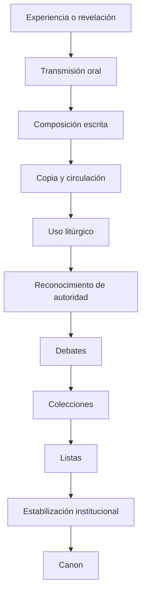

# 16 - Cómo se forma un canon religioso

# 1. Escritura y canon no son sinónimos

Un texto puede ser:
- sagrado.
- inspirado.
- autorizado.
- litúrgico.
- edificante.

sin pertenecer todavía a un **canon cerrado**.

## Autoridad
¿Se utiliza el texto como fuente religiosa?

## Escritura
¿Se considera sagrado o inspirado?

## Canon
¿Existe una lista delimitada de textos reconocidos como escritura normativa?

# 2. Modelo general

No todas las religiones llegan a la última etapa.

---

# 3. Canon judío

## Torá
Alcanzó autoridad singular.

## Estructura posterior
- Torá.
- Profetas.
- Escritos.

## Segundo Templo
Qumrán muestra pluralidad:
- textos luego canónicos.
- interpretaciones.
- obras sectarias.
- Enoc.
- Jubileos.
- Tobías.
- Sirácida.
- salmos adicionales.

## Jamnia / Yavne
Debe rechazarse el modelo simplista:
> «un concilio de Jamnia cerró el canon en el año 90».

Hubo debates rabínicos, pero la estabilización fue un proceso histórico.

---

# 4. Septuaginta

En sentido estricto, «Septuaginta» designó inicialmente la traducción griega de la Torá.

Después el término se amplió a una gran colección de traducciones griegas de escrituras judías.

> No debe imaginarse una «Biblia alejandrina» perfectamente cerrada y uniforme desde el comienzo.

---

# 5. Canon cristiano

## Etapa inicial
Los primeros cristianos utilizaron:
- escrituras judías.
- tradición de Jesús.
- tradición apostólica.
- cartas.
- relatos sobre Jesús.

## Cartas paulinas
Circularon tempranamente como colección.

## Cuatro Evangelios
A finales del siglo II, Ireneo defiende explícitamente cuatro:
- Mateo.
- Marcos.
- Lucas.
- Juan.

## Libros discutidos
- Hebreos.
- Santiago.
- 2 Pedro.
- 2 Juan.
- 3 Juan.
- Judas.
- Apocalipsis.

## Textos muy valorados pero finalmente externos
- Pastor de Hermas.
- Didaché.
- 1 Clemente.
- Bernabé.

## Atanasio, 367
La Carta Festal 39 contiene la primera lista conservada conocida exactamente igual a los 27 libros actuales del Nuevo Testamento.

> Esto no significa que Atanasio «inventara» el Nuevo Testamento.

## Desarrollo posterior
Persistieron diferencias en el Antiguo Testamento:
- católicos.
- ortodoxos.
- protestantes.
- etíopes.

---

# 6. Canon coránico

## Transmisión
Según la tradición islámica:
- memorización.
- recitación.
- escritura parcial durante la vida de Mahoma.

## Estandarización ʿutmánica
La tradición atribuye a ʿUthmān ibn ʿAffān una normalización decisiva del texto consonántico.

## Qirāʾāt
Tradiciones de lectura:
- algunas canonizadas.
- otras consideradas irregulares.

> Canon textual y canon de lecturas no son exactamente lo mismo.

---

# 7. Cánones budistas
[[Proyecto Biblia/Arte, cultura y otros temas/Religiones_del_Mundo/04 - Budismo y sus cánones]]nes]].

---

# 8. Avesta

Proceso:
- transmisión oral.
- estratos de avéstico antiguo y joven.
- fijación y organización sasánida.
- pérdida progresiva de materiales.
- preservación medieval por sacerdotes.

> El Avesta conservado es también el resultado de **preservación selectiva y pérdida histórica**.

---

# 9. Comparación

| Tradición | Situación inicial | Mecanismo | Resultado |
|---|---|---|---|
| Judaísmo | múltiples textos | autoridad comunitaria y rabínica | Tanaj |
| Septuaginta | traducciones griegas | uso y recopilación | corpus variable |
| Cristianismo | Escrituras judías + tradición apostólica | uso, recepción y listas | varios cánones |
| Nuevo Testamento | Evangelios, cartas y otros escritos | apostolicidad, uso, recepción | 27 libros |
| Islam | revelación oral/escrita | estandarización temprana | Corán |
| Qirāʾāt | variantes de lectura | selección tradicional | lecturas canónicas |
| Theravāda | transmisión oral | memorización + escritura | Canon Pāli |
| Budismo chino | traducciones masivas | catálogos + ediciones | canon chino |
| Budismo tibetano | traducciones indias | clasificación monástica | Kangyur/Tengyur |
| Zoroastrismo | tradición ritual oral | fijación + preservación | Avesta superviviente |
| Yārsān | poesía y tradición oral | canonizaciones múltiples | canon abierto/no uniforme |
| Yoruba/Ifá | oralidad ritual | memorización sacerdotal | 256 odù |

# 10. Factores de canonización

1. antigüedad;
2. autoría atribuida;
3. relación con fundador o profeta;
4. uso litúrgico;
5. aceptación comunitaria;
6. coherencia doctrinal;
7. transmisión manuscrita;
8. autoridad institucional;
9. necesidad de diferenciar textos aceptados de rivales.

Ningún factor funciona universalmente.
